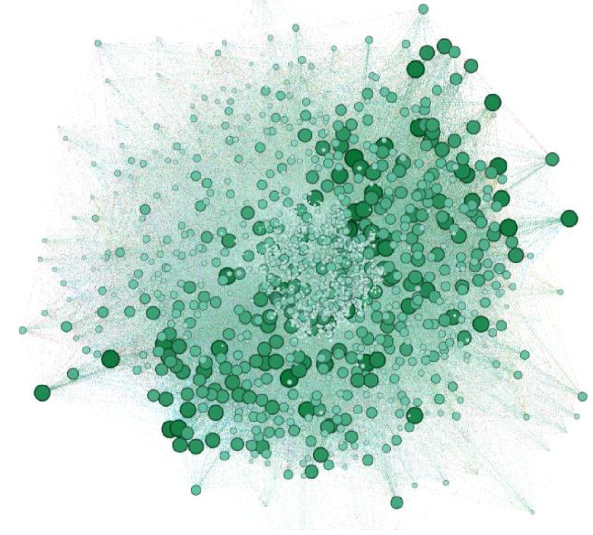
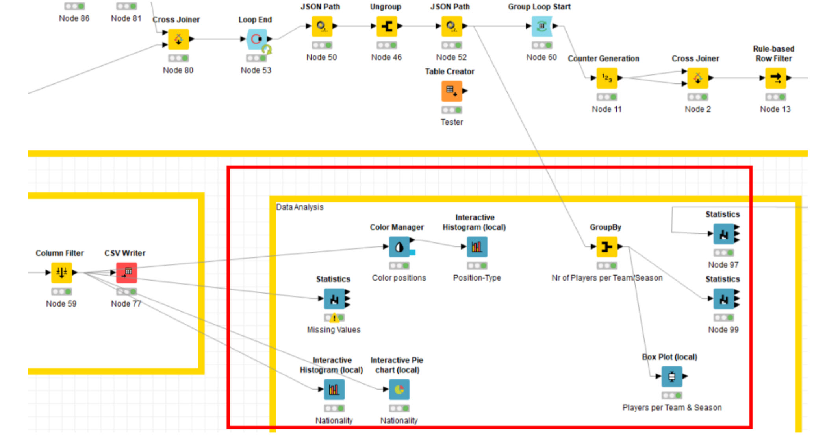
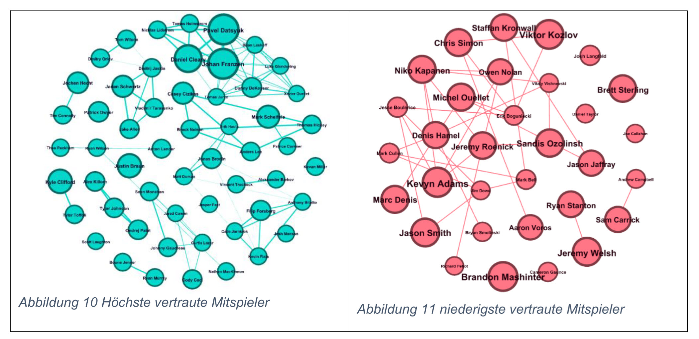
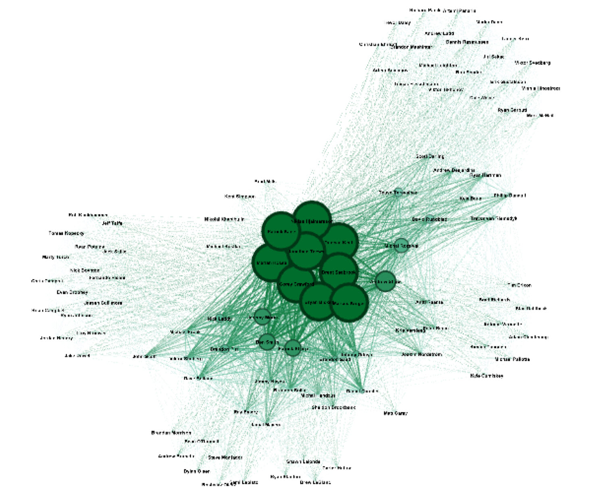

# Netzwerk Analyse für NHL Spieler

## Kurz
### Ziel
Aus verschiedenen Datenquellen werden ca. 456'750 Datensätze aus der NHL-API verarbeitet. Diese Datensätze enthalten Infomrationen zu Spielern, Teams und Seasons. 
Die Informationen sollen mittels einer Netzwerkanalyse beispielsweise so analysiert werden, dass Spieler, die ihrem Verein längere Zeit true bleiben, identifiziert werden können. 

### Projekt-Team
•	Riedi Manuel  
•	Hürzeler Janick  
•	Winter Joël

### Tools
•	Gephi  
•	Python  
•	Json  
•	KNIME

### Bedeutung Knoten und Kanten
Die Knoten im Netzwerk bilden die einzelnen Spieler. Die Kanten haben die Bedeutung «hat zusammen gespielt mit» und können mit verschiedenen Werten, wie z.B. Anzahl Spiele, Anzahl Saisons oder Anzahl verschiedene gemeinsame Teams gewichtet werden. Es handelt sich somit um ein One-Mode-Netzwerk.

## Vorgang
### 1 Datenbeschaffung
Daten werden von der NHL über ihre Stats-API (https://statsapi.web.nhl.com/api/v1, abgerufen  
In einem ersten Schritt wurde ein API-Fetcher in Python programmiert, der in Form eines Jupyter Notebooks die benötigten API-Calls pro Jahr durchführt. Die geladenen Daten einer Anfrage werden dabei als JSON-Datei (UTF8-Encoding) gespeichert, damit diese zu einem späteren Zeitpunkt nicht erneut geladen werden müssen. 

Detailliertere Informationen zur Datenbeschaffung (S.1-2): [Dokumentation Datenbeschaffung](./Dokumentation/DokumentationDatenbeschaffung.pdf)  

### 2 Datenaufbereitung
Mit KNIME werden die gesammelten Daten aus den JSON-Files zu einem Node- und einem Edge-Table transformiert, sodass sie später in Gephi optimal eingesetzt werden können.
[KNIME Workflow](./Source/Knime/SNA_Projekt.knwf)

Detailliertere Informationen zur Datenaufbereitung (S.2-7): [Dokumentation Datenbeschaffung](./Dokumentation/DokumentationDatenbeschaffung.pdf)  

### 3 Datenanalyse
Für die Analyse mittels Graphen wurde die freie Software Gephi verwendet. Es werden folgend drei untersuchte Analysen vorgestellt. 
Für detailliertere Informationen über die Analysen bitte [Dokumentation Soziale Netzwerkanalyse](./Dokumentation/DokumentationSozialeNetzwerkanalyse.pdf) verwenden. 

#### Analyse: Vertrauten Mitspieler
Bei dieser Untersuchung sollen die Spieler identifiziert werden, welche auf eine grosse bzw. kleine Anzahl vertrauter Mitspieler setzen können. Um eine Aussage diesbezüglich machen zu können, werden zwei folgende Überlegungen über die Spieler-Knoten gemacht:
• Spieler mit hoher “Degree Centrality” und verhältnismässig niedriger “WeightedDegree Centrality”, wechseln oft das Team und sollten daher eher weniger vertraute Spieler aufweisen.
• Spieler mit niedriger “Degree Centrality” und verhältnismässig hoher “WeightedDegree Centrality”, bleiben ihrem Team eher treu und sollten daher auch eher eine
hohe Anzahl vertrauter Spieler aufweisen.

#### Analyse: Gegenüberstellung von «guten» und «schlechten» Teams
Bei dieser Analyse sollen eher bessere und eher schlechtere Teams aus einem gewissen Zeitraum gegenübergestellt werden. Dabei wurde anhand von Zentralitätswerten untersucht, ob treue Spieler einen Einfluss auf den Erfolg eines Teams haben. Ob eher gleich bleibende Kader ohne viele Spielerwechsel zum Erfolg beitragen können, wurde über die Dichte des Netzwerks versucht herauszufinden.

#### Analyse: Cliquen
Bei dieser Analyse wurde untersucht, ob sich verschiedene Cliquen gebildet haben. Für den k-Core wurde die Grenzwerte für k ermittelt. In den gefundenen Cliquen wurde die Betweenness-Centrality für eher treue und untreue Spieler im Detail analysiert.

